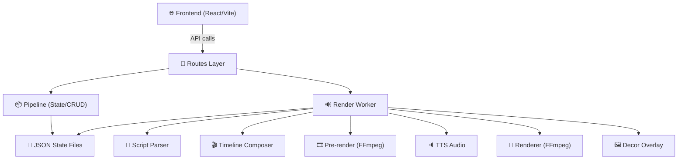
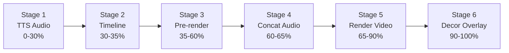

# News Bulletin Pipeline — Phân Tích Luồng Code

> **Mục đích**: Tài liệu phân tích chi tiết luồng xử lý, các file, hàm chính và vấn đề tồn đọng trong pipeline News Bulletin.

---

## 1. Tổng Quan Kiến Trúc



### File Map

| Layer | File | Chức năng |
|-------|------|-----------|
| **Routes** | `src/routes/news_bulletin_routes.py` | Flask Blueprint — tất cả API endpoints |
| **Pipeline** | `src/utils/news_bulletin_pipeline.py` | CRUD bulletin, quản lý state/progress/resources |
| **Render Worker** | `src/utils/news_bulletin_render_worker.py` | Background render — orchestrator chính |
| **Script Parser** | `src/processors/news_script_parser.py` | Parse kịch bản text → JSON cấu trúc |
| **News Timeline** | `src/composer/news_timeline.py` | Xây dựng timeline segments cho bulletin |
| **Renderer** | `src/composer/renderer.py` | FFmpeg render: concat clips + audio + overlay |
| **Channel Manager** | `src/utils/channel_manager.py` | CRUD channels/groups (JSON-based) |
| **Decor Images** | `src/utils/decor_images.py` | Quản lý banner PNG overlay per-channel |
| **FFmpeg Helper** | `src/utils/ffmpeg_helper.py` | Wrapper FFmpeg: run, probe, progress |
| **TTS Audio** | `src/utils/tts_audio.py` | Text-to-Speech API integration |
| **Audio Utils** | `src/processors/audio_utils.py` | Probe audio duration |
| **Config** | `src/config.py` | Tất cả config (env-based) |

---

## 2. Luồng Xử Lý Chính (End-to-End)

### Step 1: Parse Script
**File**: [news_script_parser.py](file:///e:/CRAWL%20VIDEO%20-%20AUDIO%20-%20QS/src/processors/news_script_parser.py)

| Hàm | Dòng | Mô tả |
|-----|------|-------|
| `parse_news_script(raw_text)` | L35-132 | Parse text có markers thành JSON |
| `get_all_tts_segments(parsed)` | L135-189 | Chuyển parsed → danh sách TTS segments |

**Markers hỗ trợ:**
- `//intro` → Lời mở đầu
- `//resume-news-N` → Tóm tắt tin N
- `//detail` → Cầu nối trước chi tiết
- `//detail-news-N` → Chi tiết tin N
- `//end-outro` → Kết thúc

**Output JSON:**
```json
{
  "intro": {"text": "..."},
  "detailIntro": {"text": "..."},
  "newsItems": [{"id": 1, "resumeText": "...", "detailText": "..."}],
  "outro": {"text": "..."}
}
```

### Step 2: Create Bulletin
**File**: [news_bulletin_pipeline.py](file:///e:/CRAWL%20VIDEO%20-%20AUDIO%20-%20QS/src/utils/news_bulletin_pipeline.py)

| Hàm | Dòng | Mô tả |
|-----|------|-------|
| `create_bulletin(script_text, channel_ids)` | L78-154 | Tạo bulletin mới, lưu state + progress |
| `load_bulletin_state(id)` | L157-158 | Đọc state.json |
| `load_bulletin_progress(id)` | L161-162 | Đọc progress.json |
| `save_bulletin_state(id, state)` | L170-172 | Ghi state.json |
| `save_bulletin_progress(id, progress)` | L165-167 | Ghi progress.json |
| `list_bulletins()` | L175-193 | Liệt kê tất cả bulletins |
| `add_resource_files(id, news_id, kind, paths)` | L200-242 | Thêm ảnh/video cho tin |
| `get_resource_pool(id, news_id)` | L245-270 | Lấy pool tài nguyên 1 tin |
| `get_all_resource_pools(id)` | L273-283 | Lấy pool tất cả tin |
| `get_cached_audio(id, voice_id, key)` | L311-317 | Kiểm tra audio cache |
| `save_audio_to_cache(id, voice_id, key, path)` | L320-329 | Lưu audio vào cache |

**Storage layout:**
```
storage/news_bulletin/{bulletin_id}/
├── state.json          # Trạng thái bulletin
├── progress.json       # Tiến độ render
├── script.txt          # Script gốc
├── script.json         # Script đã parse
├── resources/
│   └── news_{id}/
│       ├── vid_clips/  # Video clips
│       └── images/     # Ảnh
├── audio_cache/{voice_id}/  # Cache audio TTS
├── audio/{channel_id}/      # Audio per-channel
├── prerender/{channel_id}/  # Pre-rendered clips
├── output/                  # Video output cuối
└── temp/{channel_id}/       # Temp files
```

### Step 3: Upload Resources
**File**: [news_bulletin_routes.py](file:///e:/CRAWL%20VIDEO%20-%20AUDIO%20-%20QS/src/routes/news_bulletin_routes.py)

| API Endpoint | Method | Hàm | Mô tả |
|-------------|--------|-----|-------|
| `/api/news-bulletin` | POST | `api_create_bulletin()` L413 | Tạo bulletin |
| `/api/news-bulletin/<id>` | GET | `api_get_bulletin()` L442 | Lấy chi tiết |
| `/api/news-bulletin/<id>/resources/<idx>` | POST | `api_upload_bulletin_resources()` L474 | Upload ảnh/video |
| `/api/news-bulletin/<id>/resources/<idx>` | DELETE | `api_clear_bulletin_resources()` L544 | Xóa resources |
| `/api/news-bulletin/<id>/channels` | PUT | `api_update_bulletin_channels()` L569 | Cập nhật channels |
| `/api/news-bulletin/<id>/script` | PATCH | `api_update_bulletin_script()` L594 | Sửa script |
| `/api/news-bulletin/<id>/start-render` | POST | `api_start_bulletin_render()` L649 | Bắt đầu render |
| `/api/news-bulletin/<id>/progress` | GET | `api_get_bulletin_progress()` L466 | Polling tiến độ |
| `/api/news-bulletin/<id>/retry-render` | POST | `api_retry_bulletin_render()` L702 | Retry failed |

### Step 4: Start Render (Background)
**File**: [news_bulletin_render_worker.py](file:///e:/CRAWL%20VIDEO%20-%20AUDIO%20-%20QS/src/utils/news_bulletin_render_worker.py)

| Hàm | Dòng | Mô tả |
|-----|------|-------|
| `start_bulletin_render(bulletin_id)` | L854-901 | Entry point — spawn threads per channel |
| `_validate_channel_ready(ids)` | L832-851 | Validate voice + media trước render |
| `_render_channel(bulletin_id, channel_id, parsed)` | L476-826 | **Core render pipeline cho 1 channel** |

#### `_render_channel` — 6 Stages:



**Stage 1: TTS Audio (0-30%)**
- Lấy tất cả TTS segments từ `get_all_tts_segments()`
- Check cache → nếu có dùng lại, không thì gọi TTS API
- Hàm `_tts_segment_audio()` (L171-221): split text → chunks → call API → concat

**Stage 2: Timeline (30-35%)**
- Tạo `NewsTimelineComposer` với `vid_clip_duration=5.0`, `img_clip_duration=6.0`
- Gọi `build_full_timeline()` để xây dựng timeline

**Stage 3: Pre-render Clips (35-60%)**
- Duyệt qua tất cả segments, pre-render từng clip:

| Hàm | Dòng | Mô tả |
|-----|------|-------|
| `_pre_render_video_clip()` | L53-69 | Scale+pad video → 1080p, trim duration |
| `_pre_render_looped_video_clip()` | L72-89 | Loop video ngắn để fill duration |
| `_pre_render_image_clip()` | L92-109 | ⚠️ **Tạo still video từ ảnh — CHƯA CÓ ANIMATION** |

**Stage 4: Concat Audio (60-65%)**
- `_concat_audio_files()` (L224-237): Nối tất cả audio segments → master audio

**Stage 5: Render Video (65-90%)**
- Sử dụng `Renderer.render()` từ `composer/renderer.py`
- Chọn strategy: fast (stream-copy) hoặc chunked/single-pass

**Stage 6: Decor Overlay (90-100%)**
- `_compute_overlay_events()` (L244-290): Tính timing cho banner overlay
- `_apply_decor_overlay()` (L293-425): FFmpeg overlay banner + drawtext title

### Step 5: Timeline Composition
**File**: [news_timeline.py](file:///e:/CRAWL%20VIDEO%20-%20AUDIO%20-%20QS/src/composer/news_timeline.py)

| Hàm | Dòng | Mô tả |
|-----|------|-------|
| `shuffle_news_order(news_ids)` | L41-45 | Shuffle thứ tự tin (deterministic per-channel) |
| `build_resume_segment(dur, vids, imgs)` | L47-89 | Pick 1-2 clips cho resume |
| `build_detail_segment(dur, vids, imgs)` | L91-154 | Allocate N clips cho detail |
| `build_full_timeline(...)` | L156-303 | **Xây timeline hoàn chỉnh** |

**Cấu trúc timeline:**
```
channel_intro → intro → [resume_1 → transition → resume_2 → ...]
→ transition → detail_intro → [detail_1 → transition → detail_2 → ...]
→ transition → outro → channel_outro
```

### Step 6: Final Render
**File**: [renderer.py](file:///e:/CRAWL%20VIDEO%20-%20AUDIO%20-%20QS/src/composer/renderer.py)

| Hàm | Dòng | Mô tả |
|-----|------|-------|
| `render()` | L852-898 | **Entry point** — chọn strategy + optional overlay |
| `_render_fast()` | L504-578 | Stream-copy concat (nhanh nhất) |
| `_run_single_pass_render()` | L173-237 | Render 1 pass với filter_complex |
| `_run_chunked_render()` | L430-502 | Chia chunk → render → join |
| `_build_filter_complex()` | L75-124 | Build FFmpeg filter: xfade transitions |
| `_apply_overlays()` | L770-826 | Post-process: PiP video + source text |

---

## 3. Vấn Đề Tồn Đọng

### 🔴 Issue 1: Ảnh chưa có Animation

**Vị trí**: `_pre_render_image_clip()` — [news_bulletin_render_worker.py:L92-109](file:///e:/CRAWL%20VIDEO%20-%20AUDIO%20-%20QS/src/utils/news_bulletin_render_worker.py#L92-L109)

**Hiện trạng**: Hàm chỉ tạo **still video** từ ảnh tĩnh (loop image → video), KHÔNG có bất kỳ animation nào (zoom, pan, Ken Burns effect...).

```python
# HIỆN TẠI — chỉ scale+pad, không animation
cmd = [
    "ffmpeg", "-y",
    "-loop", "1", "-i", src_path,
    "-t", str(duration),
    "-vf", f"scale=1920:1080:...,pad=...,fps=30,...",
    "-c:v", "libx264", "-preset", "ultrafast", "-an",
    dst_path,
]
```

**Yêu cầu**:
- Áp dụng animation cho ảnh (zoom in/out, pan left/right, Ken Burns)
- Mỗi ảnh duration ngẫu nhiên **4-6 giây**
- Animation được chọn ngẫu nhiên cho mỗi ảnh

**Giải pháp đề xuất**: Thêm FFmpeg filter `zoompan` hoặc kết hợp `scale` + `crop` animation:
```python
# VÍ DỤ — zoom in chậm (Ken Burns)
"-vf", f"zoompan=z='min(zoom+0.001,1.2)':d={fps*duration}:s=1920x1080:fps={fps}"

# VÍ DỤ — pan left to right
"-vf", f"zoompan=z='1.15':x='iw/2-(iw/zoom/2)+((iw/zoom)*on/{fps*duration})':d={fps*duration}:s=1920x1080"
```

**Ảnh hưởng**: Cần sửa cả 2 nơi gọi `_pre_render_image_clip()`:
1. L693: trong vòng lặp clips của resume/detail segments
2. L659, L678: fallback visual cho intro/detail_intro/outro

### 🔴 Issue 2: Banner Text chưa có Animation

**Vị trí**: `_apply_decor_overlay()` — [news_bulletin_render_worker.py:L293-425](file:///e:/CRAWL%20VIDEO%20-%20AUDIO%20-%20QS/src/utils/news_bulletin_render_worker.py#L293-L425)

**Hiện trạng**:
- ✅ **Banner image**: Đã có animation slide-up + fade-in, slide-down + fade-out (Y animation + alpha animation)
- ❌ **Banner text (drawtext)**: Chỉ có `enable='between(t,...)'` — text xuất hiện/biến mất **đột ngột**, KHÔNG đồng bộ animation với banner

```python
# HIỆN TẠI — Banner image CÓ animation:
y_expr = f"if(lt(t,{fade_in_end}),{y_start}+({y_final}-{y_start})*(t-{t_start})/{anim_duration},...)"
alpha_expr = f"if(lt(t,{fade_in_end}),(t-{t_start})/{anim_duration},...)"

# HIỆN TẠI — Text KHÔNG có animation (chỉ enable/disable):
f"drawtext=text='{title}':...:x={abs_title_x}:y={abs_title_y}:enable='{enable}'"
```

**Yêu cầu**: Text cần animation đồng bộ với banner image:
- Slide-up cùng lúc với banner
- Fade-in/out cùng alpha

**Giải pháp đề xuất**: Thêm `y` expression và `alpha` cho drawtext:
```python
# Text Y animation đồng bộ với banner
dt_y_expr = f"if(lt(t,{fade_in_end}),{y_start+title_offset_y}+({y_final+title_offset_y}-{y_start+title_offset_y})*(t-{t_start})/{anim_duration},if(gt(t,{fade_out_start}),...))"

# Text alpha animation
dt_alpha_expr = alpha_expr  # Dùng chung alpha với banner

f"drawtext=text='{title}':...:y='{dt_y_expr}':fontcolor_expr='ffffff%{{eif\\:{alpha_255_expr}\\:x\\:2}}':enable='{enable}'"
```

---

## 4. Các Module Phụ Trợ

### Channel Manager
**File**: [channel_manager.py](file:///e:/CRAWL%20VIDEO%20-%20AUDIO%20-%20QS/src/utils/channel_manager.py)

Quản lý channels/groups qua JSON file (`storage/channels/index.json`). Mỗi channel chứa: `voiceId`, `introVideoPath`, `transitionVideoPath`, `outroVideoPath`, `decorVideoId`, `sourceText`.

### Decor Images
**File**: [decor_images.py](file:///e:/CRAWL%20VIDEO%20-%20AUDIO%20-%20QS/src/utils/decor_images.py)

Quản lý PNG banner (1920×300) per-channel với metadata: `titleOffsetX/Y`, `titleMaxWidth`, `titleFontSize`, `titleColor`.

### FFmpeg Helper
**File**: [ffmpeg_helper.py](file:///e:/CRAWL%20VIDEO%20-%20AUDIO%20-%20QS/src/utils/ffmpeg_helper.py)

| Hàm | Mô tả |
|-----|-------|
| `run_command(cmd, timeout, progress_cb)` | Chạy FFmpeg với progress tracking |
| `get_nvenc_flags()` | GPU NVENC hoặc CPU libx264 flags |
| `probe_duration(path)` | ffprobe lấy duration |

### Config
**File**: [config.py](file:///e:/CRAWL%20VIDEO%20-%20AUDIO%20-%20QS/src/config.py)

Key configs cho bulletin:
- `TARGET_RESOLUTION`: 1920x1080
- `TARGET_FPS`: 30
- `DECOR_IMAGE_ANIM_DURATION`: 0.5s (animation banner)
- `DECOR_IMAGE_GAP_SECONDS`: 0.5s (gap giữa các events)
- `IMAGE_ONLY_SKIP_XFADE`: true (fast render mode)

---

## 5. Tóm Tắt Luồng Render Hoàn Chỉnh

```
User tạo Bulletin (script + channels + resources)
    ↓
start_bulletin_render() → spawn 1 thread per channel
    ↓ (mỗi thread chạy _render_channel)
    ├── [0-30%]  TTS: text → API → audio files (có cache)
    ├── [30-35%] Timeline: parsed_script + audio_durations + resources → segments
    ├── [35-60%] Pre-render: mỗi clip → ffmpeg → 1080p/30fps MP4
    │   ├── Video: scale+pad+trim
    │   ├── Image: loop → still video ⚠️ (chưa animation)
    │   └── Looped: loop video ngắn fill duration
    ├── [60-65%] Concat Audio: tất cả segment audio → master.m4a
    ├── [65-90%] Render: concat clips + master audio → video
    │   └── Strategy: fast (stream-copy) | chunked | single-pass
    └── [90-100%] Decor Overlay (optional):
        ├── Banner image: slide-up + fade ✅
        ├── Banner text: drawtext ⚠️ (chưa animation)
        └── Output: final video
```
